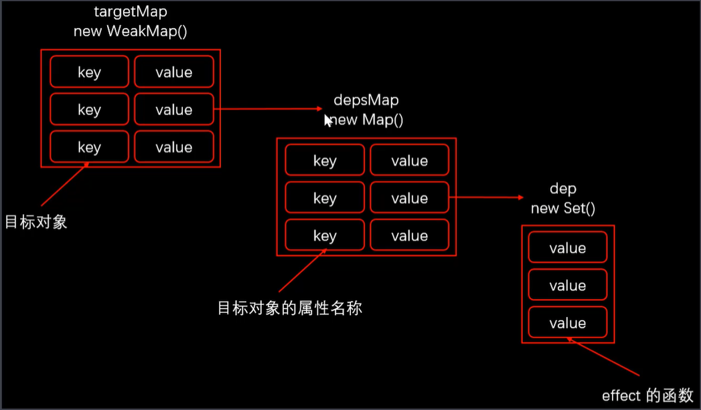

# setup

组合式API的入口，在组件实例创建之前执行。一个接受props和context的函数，从setup中返回的所有内容都将暴露给组件的其余部分（计算属性、方法、生命钩子函数等）及组件的模板


# reactive/toRefs/ref

reactive函数返回对象的响应式副本，这个响应式是嵌套的，但是reactive的返回值解构后则不是响应式。

- 使用Proxy对象实现属性监听
- 多层属性嵌套时，在访问属性过程中处理下一级属性
- 默认监听动态添加的属性
- 默认监听属性的删除操作
- 默认监听数组的索引和length属性
- 可作为单独模块使用

```js
const obj = reactive({
    foo: 1
    bar: {
    	b: 'a'
	}
})
```


ref函数接受一个参数，并将其包装成一个具有value属性的对象，使其具有响应式，可以使用这个value访问或更改响应式变量的值

```js
import { ref } from 'vue'

const count = ref(0)

console.log(count) // { value: 0}

count.value++
console.log(count.value) // 1
```

ref和reactive的区别

- ref可以将基本类型数据转换成响应式对象
- ref返回的对象，重新赋值成对象，也是响应式的
- reactive返回的对象，重新赋值的时候会丢失响应式
- reactive返回的对象不能解构

因此，当一个对象属性很多的时候，适合使用reactive，如果只是单个的值想要设置成响应式，适合使用ref


toRefs将**响应式对象转换为普通对象**，结果对象中每个property都是指向原始对象相应property的ref

```js
const state = reactive({
    foo: 1,
    bar: 2
})

const stateAsRefs = toRefs(state)

/*
{
	foo: Ref<number>
	bar: Ref<number>
}
*/
```

# computed/watch/watchEffect

computed

接收一个getter函数，并为getter的返回值创建一个不可变的响应式ref对象，或者可以接收一个带有getter和setter的对象，来创建一个可写的ref对象

```js
const count = ref(1)
const plusOne = computed(() => count.value++)

console.log(plusOne.value) // 2

plusOne.value++ // error


const count2 = ref(1)
const plus2 = computed({
  get: () => count2.value + 1,
  set: val => {
    count2.value = val - 1
  }
})

plus2.value = 1
console.log(count2.value) // 0
```

watchEffect

为了根据响应式状态自动应用和重新应用**副作用**，可以使用watchEffect方法。接收一个函数，并立即执行，同时响应式追踪其依赖，在依赖变更时再次执行该函数

```js
const count = ref(0)

watchEffect(() => {
    console.log(count.value)
}) // log 0

count.value++ // log 1
```


watchEffect在组件setup函数或生命钩子函数被调用时链接到组件的声明周期，在组件卸载时自动停止，也可显示调用返回值来停止更新

```js
const stop = watchEffect(...)
stop()
```

副作用函数中可能会有一些异步的副作用，需要在依赖的状态改变之后，清除掉之前还没完成的异步任务

可接收一个onInvalidate函数作为入参，来注册清理失效时的回调，当以下情况发生时，失效回调会被处罚

- 副作用即将重新执行的时候
- 侦听器被停止（手动或组件卸载）

如果副作用函数是一个异步函数，则需要在异步函数调用之前注册清理函数

```js
const data = ref(null)

watchEffect( async onInvalidate => {
    onInvalidate(...) // 在Promise解析之前注册清理函数
    data.value = await fetch(params)
})
```

副作用函数的执行时机是在**更改了依赖状态后，组件更新前**，可传入一个带有flush选项的附加options对象来修改这一时机

```js
watchEffect({
    () => {},
    {
        flush: 'post' // 'pre'/'sync'
    }
})
```

- post: 组件更新后执行
- pre：组件更新前执行
- sync：组件更新时同步执行

在开发模式下，可以在options对象中添加onTrack和onTrigger属性来调试侦听器行为


watch

watch需要侦听特定的数据源，并在回调中执行副作用

与watchEffect的区别：

- 可访问侦听状态变化前后的值
- 可侦听多个状态

其他的停止侦听、清除副作用、调试、侦听时机等行为，与watchEffect相同

# 依赖收集

Vue3中通过reactivity模块中的effect函数来收集依赖，进而实现当依赖更新的时候，触发注册的回调

收集依赖的过程如图所示



整个过程中有三个集合，第一个是targetMap，存储的是目标对象与depsMap的集合。depsMap存储的是目标对象的key与回调集合dep的entity。

1. 在响应式对象getter中调用effect函数收集依赖，注册回调事件
2. 在setter/deleteProperty中调用trigger函数执行回调