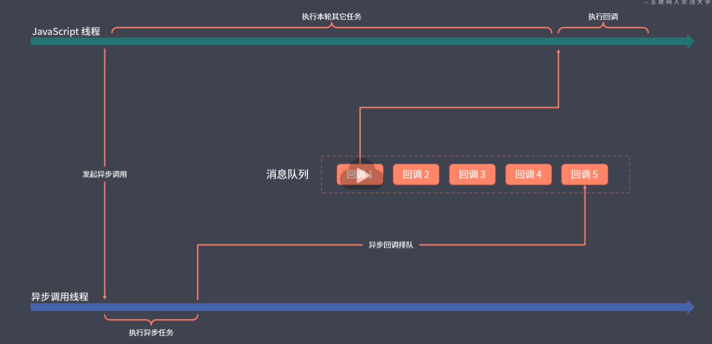

# 背景

JS运行环境是单线程的，因为JS最早设计出来就是一门为了在浏览器执行的脚本语言，实现页面的交互。

实现页面交互必须使用单线程模型，否则会产生线程同步问题。

tips：JS虽然是单线程，但浏览器并不是单线程

单线程优点：安全、简单

缺点：易阻塞

为了解决单线程的易阻塞缺点，JS将任务的执行模式分为同步模式（Synchronous）和异步模式(Asynchronous)

**同步模式**

 除了变量和函数的声明，其他调用型的代码按照书写顺序依次压入函数调用栈中执行，执行后弹出调用栈

同步模式容易造成阻塞，需要用异步模式来处理这种问题

**异步模式**

- 不会等待这个任务的结束再开始下一个任务
- 对于耗时的操作，开启过后就立刻执行下一个任务
- 后续逻辑一般通过回调函数的方式来进行定义

单线程异步模式的缺陷：代码的执行顺序比较混乱、跳跃



# JS事件循环（EventLoop）

EventLoop是JS异步编程的实现方式，当一个异步任务有了执行结果以后，其回调函数会被放入消息队列（也是event的队列）当中，当主线程所有的同步任务结束完毕后，再去读取消息队列，取出其中的异步任务的回调函数进行执行

主线程执行完同步代码，再去从消息队列取出异步任务对应的回调函数进行执行，这个过程是不断循环的，也称为EventLoop

# 回调函数

所有异步编程方案的根基

以ajax为例：发送ajax请求的目的是为了获取服务端返回的结果去进行相应的处理

回调函数，就是对数据的处理方法

因为不知道请求什么时候能返回，所以JS在发出请求后，会继续执行后续的其他任务，等待本轮其他任务都执行完成后，再从消息队列中取出回调进行执行

**调用者定义，执行者执行，调用者告诉执行者异步任务结束后应该做什么**

# Promise(ES2015)

## 概述

一种更优的异步编程统一方案

为了解决**回调地狱**问题而生

Promise是一个对象，具有三种状态

- pending：等待状态
- fulfilled：成功状态
- rejected：失败状态

状态一旦发生，不可改变

状态改变后，会执行相应状态的回调：OnFulfilled和OnRejected 

用promise封装ajax请求

```js
const ajax = url => {
    let xhr = new XMLHttpRequest();
    return new Promise((resolve, reject) => {
        xhr.open('GET', url);
        xhr.responseType = 'json';
        xhr.onload = function() {
            if(this.status === 200) {
                resolve(this.response)
            } else {
                reject(new Error(this.statusText))
            }
        }
        xhr.send()
    })
}
```

resolve和reject是promise接收的注册函数的两个参数，调用resolve函数，使得promise状态变为fulfilled，调用reject函数，promise状态变为rejected

## 方法

promise还维护了两个静态方法，then和catch

**then方法**

promise对象的then方法会返回一个全新的promise对象，因此，promise可以进行链式调用

```js
Promise(function(resolve,reject) {
	resolve(100)
}).then(value => {
	console.log(value, 111)
    return ajax('url')
}).then(value => {
	console.log(value, 222)
}).then(value => {
	console.log(value, 333)
})
```

- 一个then方法后的then方法，是为上一个then返回的promise对象注册回调
- 前一个then中回调函数的返回值会成为后一个then中的参数
- 如果回调中返回的是promise，那么后面的then会等待它的结束再执行
- then方法只接受函数作为参数，如果接收到的参数不是函数，**将创建一个没有经过回调函数处理的新的promise对象，这个promise和调用then方法的原promise状态保持一致**

catch方法

catch方法是then方法的一种别名

```js
.catch() //相当于
.then(undefined, function())
```

catch方法多半用来捕获异常，写法上和then无甚区别

## 静态方法

resolve方法：将一个值转化为一个状态为fulfilled的promise对象

reject方法：创建一个状态为rejected的promise对象

```js
Promise.resolve('foo').then(value => {
    console.log(value) // foo
})

var promise = ajax('url');
var promise2 = Promise.resolve(promise)
console.log(promise === promise2) // true

Promise.resolve({
    then: function(onFulfilled,onRejected) {
        onFulfilled('foo')
    }
}).then(value => console.log(value)) // foo
```

## 并行执行

Promise.all()

接收一个promise对象的数组，当数组中所有promise都resolve后，返回一个promise结果的数组，当其中一个promise被reject后，all方法也会变成rejected

Promise.race()

接收一个promise对象的数组，返回第一个状态改变的promise的结果

```js
Promise.all([
    ajax('./api/test.json'),
    ajax('./api/as.json')
]).then(value => console.log(value))
.catch(err => console.log(new Error(err)))

Promise.race([
    ajax('./api/test.json'),
    new Promise((resolve,reject) => {
        setTimeout(() => {
            reject('TIMEOUT')
        }, 0);
    })
]).then(value => console.log(value))
.catch(err => console.log(new Error(err)))
```

# 宏任务/微任务

宏任务：回调队列中的任务

有时候会在宏任务执行过程中临时增添一些需求，这些需求可以作为一个新的宏任务重新被添加到回调队列当中，也可以作为一个微任务，在当前任务执行完成后立即执行

微任务的目的是提高整体的相应能力

微任务：Promise，MutationObserver，process.nextTick

其他异步回调几乎都是宏任务

# Generator(ES2015)

生成器函数

## 语法

```js
function * foo() {
    console.log('start');

    try {
        let result = yield 'foo'
        console.log(result)
    }catch(e) {
        console.log(e)
    }
}

let generator = foo();
console.log(generator.next().value); // foo
generator.next('bar') // bar

generator.throw(new Error('generator error'))
```

generator函数比普通函数多了一个*

执行generator函数，需要调用next方法，执行到generator中的第一个yield关键字位置，继续调用next，执行到下一个yield位置。

next方法返回的是一个对象

```js
{
	value: '', // yield的当前值，如果generator执行完毕，为undefined
	done: false // generator函数全部执行完毕，会返回true
}
```

调用next方法时传参，generator函数中可以接收到这个参数

调用throw方法，会抛出一个异常，但会让generator继续执行

## 异步方案

可使用递归进行处理

```js
function * main() {
    try {
        let res = yield ajax('./api/test.json')
        console.log(res)

        let res2 = yield ajax('./api/test.json')
        console.log(res2)
    } catch(err) {
        console.log(err)
    }
    
}

let g = main();
function handleResult(result) {
    if(result.done) return

    result.value.then(res => {
        handleResult(g.next(res))
    }).catch(err => {
        handleResult(g.throw(err))
    })
}

handleResult(g.next())
```

但是由于async await的出现，这种方案一般不在开发中使用了

# async await(ES2017)

是generator的一种语法糖

```js
async function main() {
    let res = await ajax('./api/test.json')
    console.log(res)

    let res2 = await ajax('./api/test.json')
    console.log(res2)
}

const promise = main()

promise.then(() => {
    console.log('all completed')
})

```

async返回的是一个Promise